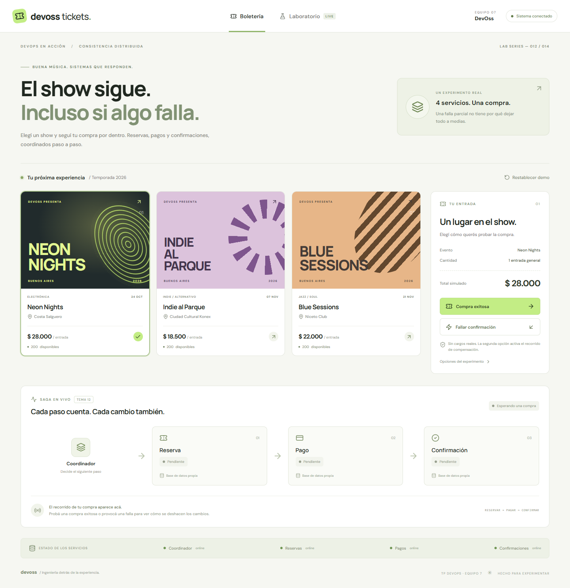
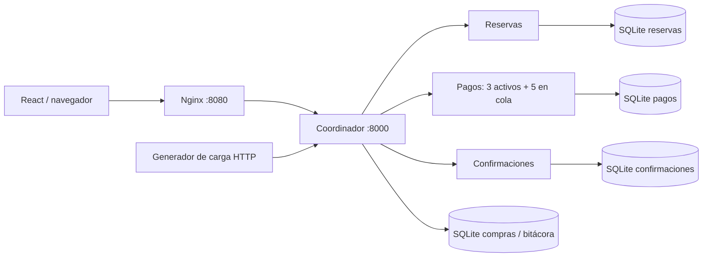

# DevOss Tickets

Una boletería de conciertos para ver **Sagas, compensaciones, bulkheads, rate limiting y backpressure** funcionando. Equipo 7 · DevOss · Temas 12 y 14.

Esta base fue importada del prototipo previo y organizada en commits por componente. Los commits de importación no representan aportes de otros integrantes.

La aplicación combina una tienda de entradas con un laboratorio de carga. Los cambios se ejecutan en cuatro servicios HTTP y bases SQLite independientes; la pantalla consulta sus estados reales.



[Ver el laboratorio de carga](docs/images/laboratorio.png)

## Ejecutar con contenedores

Requisitos: Docker Engine con el plugin Docker Compose, o Docker Desktop con contenedores Linux. La primera construcción descarga imágenes y dependencias. Puertos disponibles: `8080` y `8000`.

Desde la raíz del repositorio:

```sh
docker compose up --build
```

- Aplicación: **http://localhost:8080**
- API y documentación interactiva: **http://localhost:8000/docs**
- Esperar a que aparezcan los cuatro servicios online en la aplicación.
- También se puede iniciar en segundo plano con `docker compose up --build -d`.

```sh
docker compose ps
docker compose logs -f coordinator payments
docker compose down
```

`down` conserva los datos. El botón **Restablecer demo** borra compras y métricas, restaura 200 entradas por show y vuelve a la configuración inicial. Se bloquea mientras hay operaciones activas. Para eliminar también los volúmenes de este proyecto:

```sh
docker compose down -v
```

### Windows sin Docker Desktop

También se puede ejecutar Docker Engine directamente dentro de Ubuntu en WSL 2. No alcanza con instalar solamente el cliente `docker` en Windows.

1. En PowerShell como administrador: `wsl --install -d Ubuntu`. Reiniciar si Windows lo solicita y completar la creación del usuario de Ubuntu.
2. Verificar con `wsl -l -v` que Ubuntu usa la versión 2. Si corresponde: `wsl --set-version Ubuntu 2`.
3. Dentro de Ubuntu, seguir la [instalación oficial de Docker Engine mediante el repositorio apt](https://docs.docker.com/engine/install/ubuntu/#install-using-the-apt-repository). Instalar también `docker-buildx-plugin` y `docker-compose-plugin`, incluidos en esa guía.
4. Arrancar el daemon: `sudo service docker start`. Verificar con `sudo docker run --rm hello-world` y `sudo docker compose version`.
5. Abrir este proyecto dentro de Ubuntu. Para la ubicación actual: `cd /mnt/d/Antiquo/Documents/GitHub/tp2devops`.
6. Ejecutar `sudo docker compose up --build` y abrir http://localhost:8080 desde Windows.

Los comandos Docker de este README se ejecutan dentro de Ubuntu con `sudo` en esa modalidad. Si preferís un único instalador, [Docker Desktop con WSL 2](https://docs.docker.com/desktop/features/wsl/) gestiona el motor y Compose. No es necesario instalar ambas alternativas. [Instalación de WSL](https://learn.microsoft.com/en-us/windows/wsl/install).

Si Docker Desktop informa **Virtual Machine Platform not enabled**, habilitar **Plataforma de máquina virtual** en “Activar o desactivar las características de Windows” y reiniciar. Si la virtualización sigue sin detectarse, revisar su habilitación en BIOS/UEFI. También se necesita espacio libre para WSL y las imágenes. La app puede probarse localmente mientras se prepara Docker, pero la entrega de la materia debe demostrarse con contenedores.

## Recorrido para presentar

### 1. Compra exitosa

En **Boletería**, elegir Neon Nights y pulsar **Compra exitosa**. El recorrido muestra reserva, pago y confirmación. Quedan 199 entradas, una reserva `reserved`, un pago `charged` y una confirmación `confirmed`.

### 2. Falla y compensaciones

Restablecer la demo. Pulsar **Fallar confirmación**. El tercer servicio devuelve una falla intencional antes de confirmar. El coordinador reembolsa el pago y luego libera la reserva. El resultado es `compensated`: stock nuevamente en 200, reserva `cancelled` y pago `refunded`.

En **Opciones del experimento**, activar también la falla del reembolso. La compra quedará `compensation_pending` y conservará la reserva hasta completar la compensación. **Reintentar compensación** quita la falla inyectada del reembolso y repite las acciones idempotentes.

### 3. Rate limiting

En **Laboratorio**, usar 50 solicitudes y pulsar **Probar rate limiting**. Todas usan la misma identidad de cliente. Un token bucket admite una ráfaga inicial de hasta 10 y repone 10 tokens por segundo. El exceso devuelve **429** y `Retry-After: 1`. En este escenario el bulkhead está desactivado para observar solamente la limitación de frecuencia.

No se promete un conteo exacto de 40 rechazos: depende de cuánto tarde en llegar la ráfaga y de la reposición de tokens. Las solicitudes rechazadas por frecuencia no crean compras.

### 4. Bulkhead y consumidor lento

Restablecer, seleccionar 50 solicitudes y pagos de 2 segundos, y pulsar **Saturar pagos**. El rate limiter está desactivado. Pagos admite **3 cobros activos y 5 en espera**; el exceso devuelve **503**, `bulkhead_full` y `Retry-After`. El coordinador compensa las reservas de compras rechazadas.

Mientras tanto, otra tarea consulta el catálogo y mide su latencia. La gráfica, las verificaciones finales y el stock muestran que los límites se respetaron y el catálogo siguió accesible. Las consultas del catálogo no usan los cupos de pagos.

### 5. Backpressure y comparación

**Aplicar backpressure** repite la prueba con un productor que espera `Retry-After` y hace hasta tres reintentos con demora creciente y dispersión. Un nuevo intento de compra solamente se realiza cuando la anterior quedó compensada; nunca se repite un cobro incierto. Los rechazos finales siguen visibles: reintentar no garantiza que toda la ráfaga entre.

**Comparar sin protecciones** desactiva ambos límites. El pico de pagos activos puede superar 3. La demo usa esperas asíncronas, por lo que no pretende provocar un colapso real de CPU o memoria: demuestra consumo concurrente sin límite frente a capacidad acotada.

Restablecer entre escenarios evita acumular ventas y conserva una comparación clara.

## Verificaciones reproducibles

Con Compose iniciado y sin ejecutar pruebas desde la pantalla al mismo tiempo:

```sh
docker compose --profile tools run --rm verify
```

Ejecuta compras exitosas, compensación, rate limiting, bulkhead, backpressure y comparación sin límites. Consulta estados, comprueba stock y verifica los resultados. **Restablece los datos antes de cada escenario** y termina con código distinto de cero si alguna comprobación falla.

Para un solo caso:

```sh
docker compose --profile tools run --rm verify python scripts/demo.py failure
docker compose --profile tools run --rm verify python scripts/demo.py bulkhead
```

Desde Python local también puede usarse `python scripts/demo.py all --url http://localhost:8000` con las dependencias del backend instaladas.

## Desarrollo local

Requisitos: Python 3.12 y Node.js 22 recomendado. La versión fijada de Vite también admite Node 18; Docker utiliza Node 22. No hace falta instalar servidores de base de datos.

En PowerShell, desde la raíz:

```powershell
python -m venv .venv
.\.venv\Scripts\python.exe -m pip install -r backend/requirements.txt
.\.venv\Scripts\python.exe scripts/local.py
```

En otra terminal:

```powershell
cd web
npm ci
npm run dev
```

Abrir http://localhost:5173. El lanzador inicia cuatro procesos en puertos 8000–8003 y guarda los datos en `.local/data`. `Ctrl+C` los detiene. No ejecutar al mismo tiempo Compose y el lanzador local en el puerto 8000.

En Linux/macOS, usar `python3 -m venv .venv` y `.venv/bin/python` en lugar de `.venv\Scripts\python.exe`.

### Tests y compilación

```powershell
.\.venv\Scripts\python.exe -m unittest discover -s tests -v
cd web
npm run build
npx playwright install chromium
npm run test:e2e
```

Los tests Python levantan servicios en 18100–18103 con bases temporales, sin modificar la demo. Se puede cambiar el bloque de puertos con `TEST_BASE_PORT`. Las pruebas del navegador requieren el backend local en 8000 y **restablecen sus datos**. Playwright inicia Vite automáticamente y verifica compra, compensación, carga y adaptación móvil.

Para usar Microsoft Edge ya instalado sin descargar Chromium, omitir `playwright install` y ejecutar en PowerShell: `$env:PLAYWRIGHT_CHANNEL='msedge'` seguido de `npm run test:e2e`.

## Arquitectura e interfaces



La imagen del backend se comparte, pero cada contenedor selecciona su rol con `SERVICE_ROLE` y mantiene su propio archivo SQLite y volumen. Los servicios participantes no publican puertos en Compose. Nginx sirve React y envía `/api/` al coordinador, sin CORS ni URLs del host codificadas en el frontend.

| Interfaz del coordinador | Función |
|---|---|
| `GET /api/catalog` | Catálogo y stock actual de reservas |
| `POST /api/purchases` | Ejecutar compra; acepta `purchase_id` UUID, `event_id`, `fail_confirmation`, `fail_refund` |
| `GET /api/purchases` | Últimas 100 compras y bitácoras |
| `GET /api/purchases/{id}` | Estado y eventos de una compra |
| `GET /api/purchases/{id}/evidence` | Consultar estado de cada participante |
| `POST /api/purchases/{id}/retry` | Reintentar compensación pendiente |
| `GET/PUT /api/settings` | Demora de pagos/pasos y activación de protecciones |
| `POST /api/load` | Iniciar prueba; `scenario`, `count` (10–60), `payment_delay_ms` (500–4000) |
| `GET /api/load/{id}` | Consultar última ejecución y comprobaciones |
| `GET /api/metrics` | Salud, cupos, cola, contadores y ejecución actual |
| `POST /api/reset` | Restablecer cuando no hay operaciones activas |
| `GET /health` | Salud del proceso |

Una compra confirmada devuelve 200. Un rechazo de frecuencia devuelve 429. Fallas de capacidad o confirmación devuelven 503, aunque la Saga haya compensado correctamente; el cuerpo distingue `compensated` de `compensation_pending`. Stock agotado devuelve 409. Reutilizar el mismo UUID con otro contenido devuelve 409. El mismo UUID y cuerpo devuelve el resultado original sin repetir efectos.

Los participantes exponen `/reserve`, `/release`, `/charge`, `/refund`, `/confirm`, `/abort` según su rol, más `/operations/{id}`, `/health`, `/metrics` y `/reset`. La cancelación atómica de confirmación impide que una respuesta tardía confirme después de iniciar un reembolso.

## Decisiones y límites de la demo

- Saga por orquestación y transacciones locales; no hay una transacción SQL global ni 2PC. Las compensaciones dejan registros auditables.
- Reservas descuenta stock atómicamente. Reservar, cobrar, reembolsar y liberar usan la compra como clave idempotente. Las cancelaciones conservan marcas para bloquear operaciones tardías.
- Ante errores de transporte se consulta el estado real antes de reintentar. Si no se puede resolver una confirmación, se conserva la compensación pendiente. El reembolso tiene capacidad independiente de los cobros.
- Un proceso y una réplica por servicio. Los límites y la cola viven en memoria; no son límites distribuidos. SQLite usa WAL y `synchronous=NORMAL` para transacciones cortas sin `await`; un corte de energía puede perder los commits más recientes. No es una política de durabilidad para pagos reales.
- La cola de pagos espera de forma asíncrona y tiene un timeout de 20 segundos. Las llamadas de la Saga tienen timeout de 25 segundos y hasta tres intentos para fallas reintentables.
- `X-Demo-Client` permite agrupar las solicitudes del experimento. Es una identidad manipulable, no autenticación ni protección contra abuso. La aplicación está pensada para ejecución local.
- Datos y bitácora persisten. No se implementa recuperación automática de Sagas tras una caída del proceso; no matar el coordinador en medio de una demo. Un sistema productivo necesitaría recuperación durable, outbox y reconciliación.
- La ejecución de carga y las métricas viven en memoria; se conserva solamente la última ejecución. Los picos del gráfico se muestrean, los picos del servicio son contadores exactos desde el último reset.
- El reset entre servicios es una operación administrativa de demostración, no una Saga transaccional. Si falla parcialmente, recuperar los servicios y repetirlo.
- No hay pagos reales, usuarios, correos ni integraciones externas. Las fuentes web son opcionales: hay tipografías locales de respaldo.

## Referencias

Referencias: [Saga](https://learn.microsoft.com/en-us/azure/architecture/patterns/saga), [Bulkhead](https://learn.microsoft.com/en-us/azure/architecture/patterns/bulkhead), [Throttling](https://learn.microsoft.com/en-us/azure/architecture/patterns/throttling), [ciclo de vida de FastAPI](https://fastapi.tiangolo.com/advanced/events/), [orden de inicio y healthchecks en Compose](https://docs.docker.com/compose/how-tos/startup-order/).
